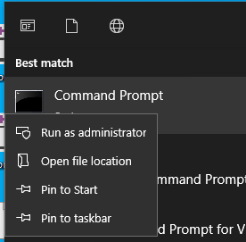
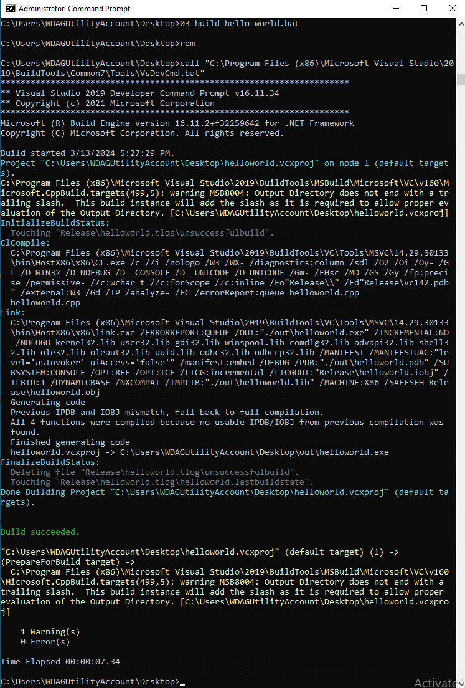
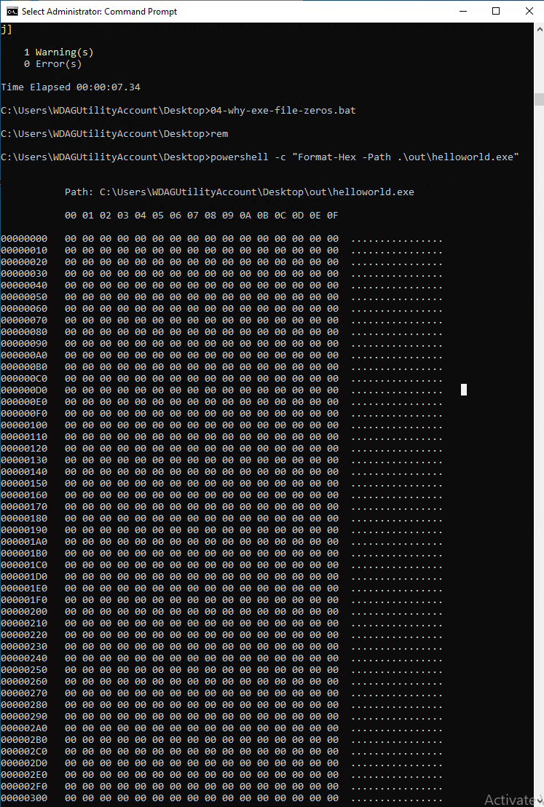

Something wrong with lastest versions Windows Sandbox and VMSMB-shared folders.
(years ago all worked OK, now we have a problem).

On some file operations, looks like editing of memorymapped files, corruption occured and files are zeroed.

Shortest example to reproduce, using compilation and linking (corruption occured on linking phase).


### Reproduction 

Clone this project.

Run windows sandbox with current folders shared as usual `C:\Users\WDAGUtilityAccount\Desktop`
```
01-start-windows-sandbox.bat 
```

In sandbox, run `cmd.exe` as Administrator


Install "minimal" (actually some gigs) compiler suite to compile "Hello world"
```
cd Desktop
02-install-compilers-into-sanbox.bat 
```

Then open another `cmd.exe` (we needed, because we should use new `Path`) as regular user, and 
Build "Hello world"
```
cd Desktop
03-build-hello-world.bat 
```




Resulting file completely zeroed!

```
04-why-exe-file-zeros.bat 
```



If we copy Desktop somewhere outside mapped folders, and reproduce building
all be OK.


 
